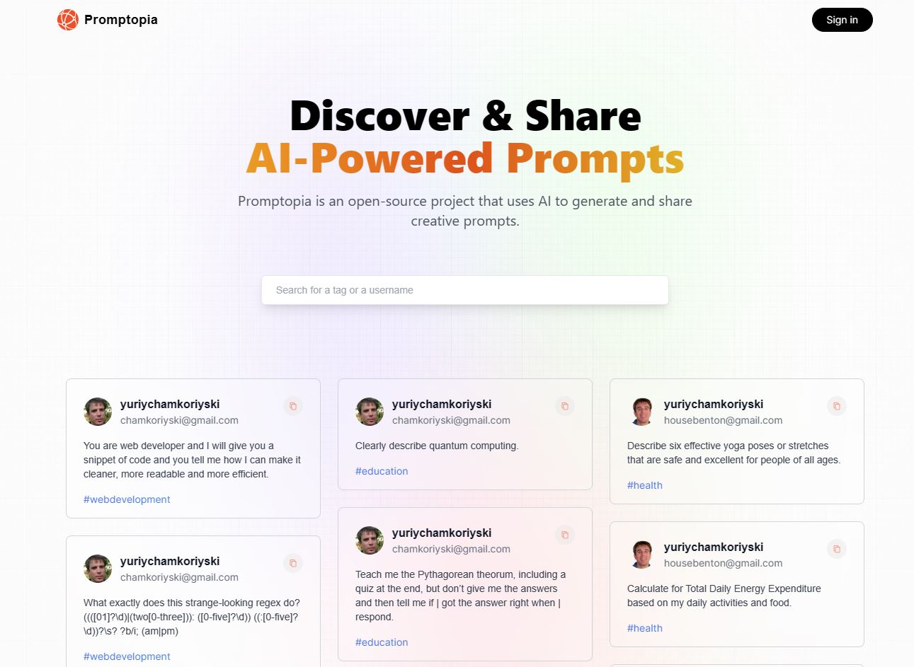
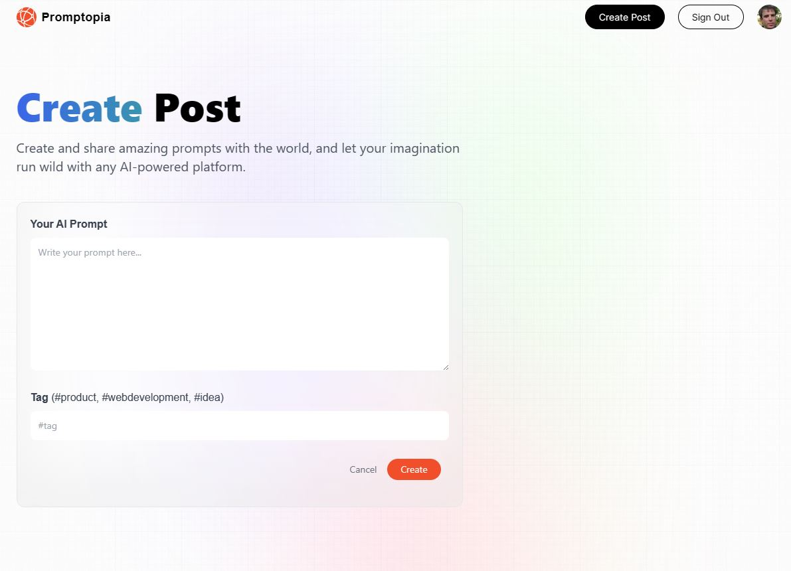

# Promptopia

> Promptopia is an open-source project that create and share prompts for ChatGPT.

## Screenshots

## Built With

- Major languages: JavaScript
- Backend: Next.JS
- Framework: Tailwind CSS, React

## Live Link

You can view the current deployment by clicking the link bellow:

[Live Link](https://promptopia-hombre2014.vercel.app/)

### Deployment

- Using [Vercel](https://vercel.com/)

## Author

👤 **Yuriy Chamkoriyski**

- GitHub: [@Hombre2014](https://github.com/Hombre2014)
- Twitter: [@Chamkoriyski](https://twitter.com/Chamkoriyski)
- LinkedIn: [axebit](https://linkedin.com/in/axebit)

## 🤝 Contributing

Contributions, issues, and feature requests are welcome!

Feel free to check the [issues page](https://github.com/Hombre/sgare-prompts/issues).

## Show your support

Give a ⭐️ if you like this project!

## Acknowledgments

Thanks to JavaScript Mastery for inspirational [video](https://www.youtube.com/watch?v=wm5gMKuwSYk&ab_channel=JavaScriptMastery).

## 📝 License

This project is [MIT](./license.md) licensed.
